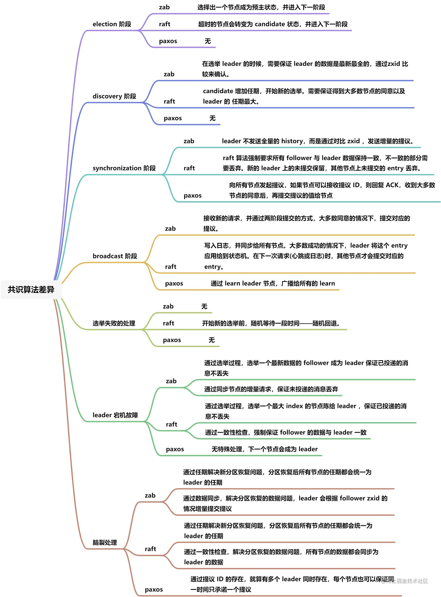

# BASE

BASE是指基本可用（Basically Available）、软状态（ Soft State）、最终一致性（ Eventual Consistency）。

### 基本可用（Basically Available）

基本可用是指分布式系统在出现故障的时候，允许损失部分可用性，即保证核心可用。

电商大促时，为了应对访问量激增，部分用户可能会被引导到降级页面，服务层也可能只提供降级服务。这就是损失部分可用性的体现。

### 软状态（ Soft State）

软状态是指允许系统存在中间状态，而该中间状态不会影响系统整体可用性。分布式存储中一般一份数据至少会有三个副本，允许不同节点间副本同步的延时就是软状态的体现。mysql replication的异步复制也是一种体现。

### 最终一致性（ Eventual Consistency）

最终一致性是指系统中的所有数据副本经过一定时间后，最终能够达到一致的状态。弱一致性和强一致性相反，最终一致性是弱一致性的一种特殊情况。

# RAFT

[论文翻译](https://arthurchiao.art/blog/raft-paper-zh/#521-heartbeat-%E5%92%8C%E9%80%89%E4%B8%BE%E8%A7%A6%E5%8F%91%E6%B5%81%E7%A8%8B)

- follower（跟随者） ：所有节点都以 follower 的状态开始。如果没收到 leader消息则会变成 candidate状态

  - candidate（候选人）：会向其他节点“拉选票”，如果得到大部分的票则成为leader，这个过程就叫做Leader选举(Leader Election)
  - leader（领导者）：所有对系统的修改都会先经过leader

### 1.1.4. Leader election (领导选举)

- Raft 使用一种心跳机制来触发领导人选举
- 当服务器程序启动时，节点都是 follower(跟随者) 身份
- 如果一个跟随者在一段时间里没有接收到任何消息，也就是选举超时，然后他就会认为系统中没有可用的领导者然后开始进行选举以选出新的领导者
- 要开始一次选举过程，follower 会给当前term加1并且转换成candidate状态，然后它会并行的向集群中的其他服务器节点发送请求投票的 RPCs 来给自己投票。
- 候选人的状态维持直到发生以下任何一个条件发生的时候
  - 他自己赢得了这次的选举
  - 其他的服务器成为领导者
  - 一段时间之后没有任何一个获胜的人

### 1.1.5. Log replication (日志复制)

- 当选出 leader 后，它会开始接收客户端请求，每个请求会带有一个指令，可以被回放到状态机中
- leader 把指令追加成一个log entry，然后通过AppendEntries RPC并行地发送给其他的server，当该entry被多数server复制后，leader 会把该entry回放到状态机中，然后把结果返回给客户端
- 当 follower 宕机或者运行较慢时，leader 会无限地重发AppendEntries给这些follower，直到所有的follower都复制了该log entry
- raft的log replication要保证如果两个log entry有相同的index和term，那么它们存储相同的指令
- leader在一个特定的term和index下，只会创建一个log entry

